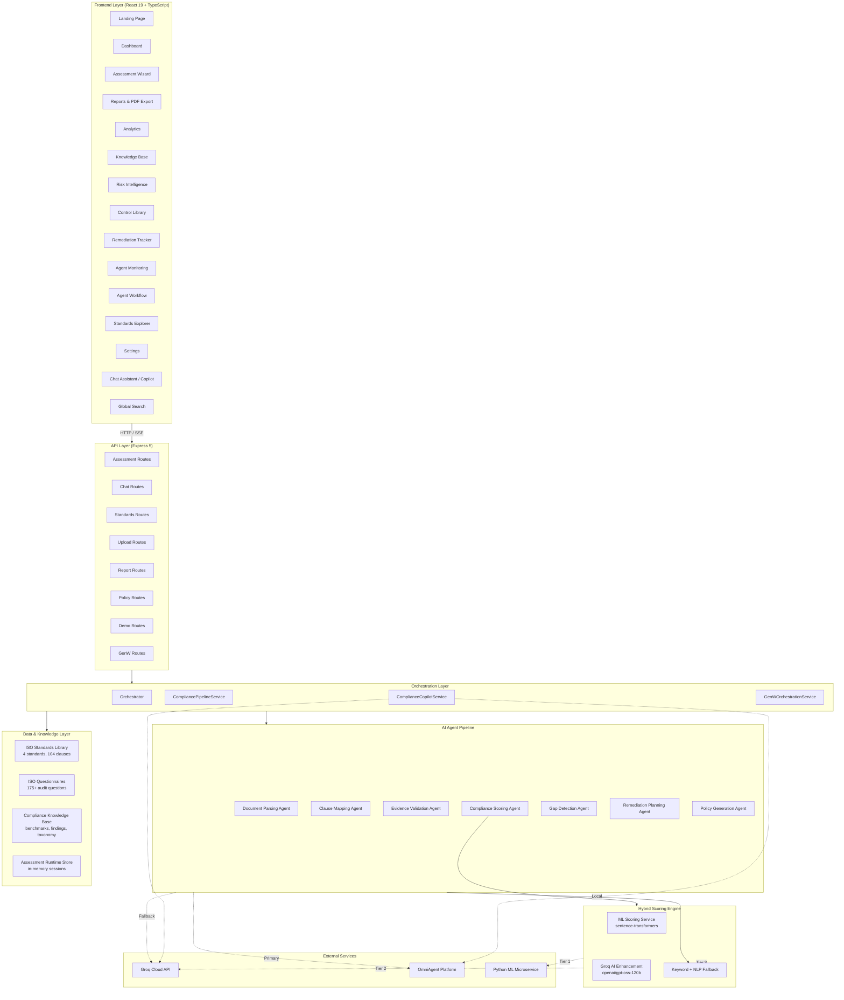
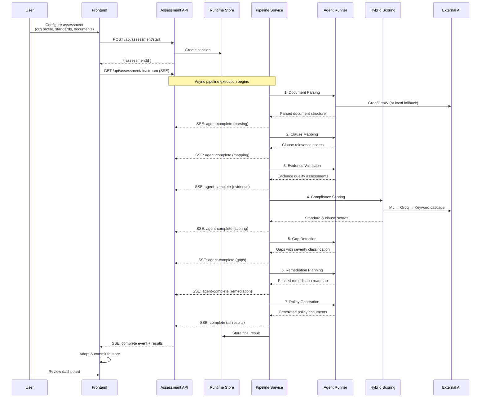
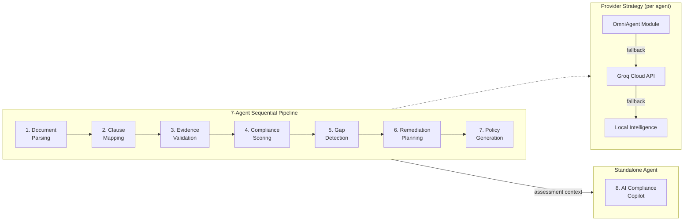
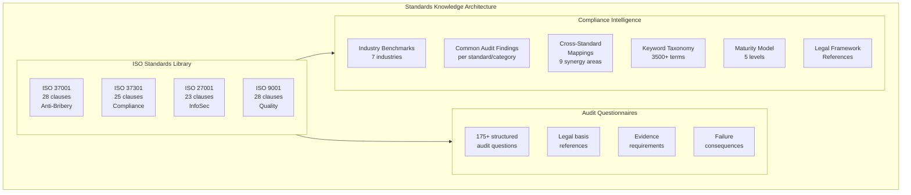

# System Architecture

## Architecture Overview

SentriX follows a layered architecture separating concerns across presentation, API, orchestration, analysis, and data layers. The system is designed for graceful degradation — every AI-dependent feature has a local fallback, ensuring the platform delivers results regardless of external service availability.



## Platform Architecture

### Layer Responsibilities

| Layer | Technology | Responsibility |
|-------|-----------|----------------|
| **Presentation** | React 19, Tailwind CSS, Recharts, Framer Motion | User interface, data visualization, page routing, state management |
| **API** | Express 5, Multer, SSE | RESTful endpoints, file upload, real-time streaming, CORS |
| **Orchestration** | CompliancePipelineService, Orchestrator | Agent sequencing, context passing, fallback routing, audit trail |
| **Analysis** | AgentRunner, HybridScoringService | AI agent execution, scoring algorithms, NLP processing |
| **Data** | In-memory stores, static ISO data | Standards definitions, questionnaires, knowledge base, runtime sessions |
| **External** | Groq SDK, OmniAgent Bridge, Python ML | Cloud AI services, semantic similarity scoring |

### Design Decisions

**Why Express 5 over NestJS or Fastify?**  
Express 5 provides the simplest path to a functional API with SSE streaming support. The application's routing complexity does not warrant a full framework — eight route modules with straightforward request/response patterns. Express 5's native async error handling eliminates the callback patterns that plagued Express 4.

**Why Zustand over Redux?**  
Assessment state is moderate in complexity (one active assessment, agent statuses, chat messages) without deep nesting or complex reducers. Zustand's single-store pattern with selective persistence middleware provides the right balance of simplicity and capability.

**Why in-memory session storage?**  
SentriX is designed as a single-session assessment tool where results are consumed immediately. In-memory storage eliminates database dependencies while providing the session lifecycle needed for SSE streaming during assessment execution. Assessment results are persisted client-side via Zustand's localStorage middleware.

**Why a three-tier scoring cascade?**  
Compliance scoring must always produce results — a system that fails when an API is unavailable is useless in enterprise environments. The three-tier cascade (ML → Groq → Keyword+NLP) ensures scoring works offline, during API outages, and without paid API keys (demo mode). Each tier adds fidelity but the fallback tier alone produces audit-defensible scores.

---

## Assessment Workflow Architecture

The assessment pipeline is the core system workflow. It coordinates seven agents in sequence, with each agent enriching a shared context object.



### Pipeline Context Flow

Each agent receives the accumulated context from previous stages and adds its own output. The `PipelineContext` object grows through the pipeline:

```
Stage 1 (Document Parsing):    { documentText, standards, orgProfile } → + parsedDocument
Stage 2 (Clause Mapping):      { ... } → + clauseMappings
Stage 3 (Evidence Validation):  { ... } → + evidenceValidation
Stage 4 (Compliance Scoring):   { ... } → + standardAssessments (with clauseScores)
Stage 5 (Gap Detection):        { ... } → + gaps
Stage 6 (Remediation Planning): { ... } → + remediationActions
Stage 7 (Policy Generation):    { ... } → + policyDocuments
```

---

## AI Multi-Agent Pipeline Architecture



### Provider Cascade Strategy

Every agent execution follows the same fallback pattern:

1. **OmniAgent** (if configured via `GENW_API_BASE_URL`): Routes to the appropriate GenW module based on agent type. Eight modules are defined (documentIntelligence, riskAnalytics, complianceKnowledge, remediationEngine, auditTrail, evidenceValidator, policyGenerator, complianceCopilot).

2. **Groq Cloud API** (if `GROQ_API_KEY` is set): Sends expert-crafted prompts to `openai/gpt-oss-120b` via Groq's inference API. Each agent has a unique prompt template declaring its role (ISO lead auditor, gap analysis specialist, etc.) with strict rules and JSON schema enforcement.

3. **Local Intelligence** (always available): NLP-based analysis using keyword taxonomy matching, compliance phrase patterns, and heuristic algorithms. Produces structured output identical in shape to AI-generated responses.

This cascade ensures the system always produces results. The provider used for each agent is tracked in the orchestration metadata, enabling audit transparency.

---

## Standards Knowledge Layer

The compliance intelligence system is backed by a structured knowledge base covering four ISO standards.



### Per-Clause Data Model

Each clause in the knowledge base contains:

| Field | Purpose |
|-------|---------|
| `id` | Clause identifier (e.g., `4.1`, `5.2.1`) |
| `title` | Human-readable clause name |
| `description` | Requirement description |
| `guidance` | Implementation guidance text |
| `category` | Classification (Context, Leadership, Planning, Support, Operation, Evaluation, Improvement) |
| `weight` | Criticality weight (1–5) used in scoring and gap severity |
| `keywords` | Array of terms for NLP matching |
| `evidenceExamples` | Array of typical evidence artifacts |

### Knowledge Base Resources

| Resource | Content | Usage |
|----------|---------|-------|
| Industry Benchmarks | Average scores for 7 industries across all standards | Benchmark comparison in analytics |
| Common Audit Findings | Typical findings by standard and category | Gap detection enrichment |
| Cross-Standard Mappings | 9 synergy areas with efficiency percentages | Remediation optimization |
| Keyword Taxonomy | 3,500+ compliance terms by standard/category | NLP scoring fallback |
| Compliance Phrases | 17 weighted NLP patterns | Evidence quality detection |
| Clause Requirements | Mandatory elements, documentation needs, scoring criteria | Detailed scoring rubrics |
| Legal Framework References | UK Bribery Act, FCPA, SOX, GDPR, NIS2 references | Questionnaire legal basis |
| Severity Matrix | Severity levels with timeframes and remediation guidance | Gap classification |

---

## Communication Patterns

### Client-Server Communication

| Pattern | Use Case | Implementation |
|---------|----------|----------------|
| **REST (JSON)** | Assessment start, copilot Q&A, standards data, report generation | Axios HTTP client → Express routes |
| **SSE (Server-Sent Events)** | Real-time agent progress during assessment | EventSource → Express SSE endpoint |
| **File Upload (multipart/form-data)** | Document upload | Multer middleware → file system storage |
| **Static File Serving** | Uploaded documents access | Express static middleware on `/uploads` |

### SSE Event Schema

During assessment execution, the server streams events to the client:

```typescript
// Agent lifecycle events
{ type: "agent-start",    data: { agentName: string } }
{ type: "agent-complete",  data: { agentName: string, summary: string } }
{ type: "agent-error",     data: { agentName: string, error: string } }

// Progress logging
{ type: "log",            data: { message: string, timestamp: string } }

// Pipeline completion
{ type: "complete",       data: AssessmentResult }
{ type: "error",          data: { message: string } }
```

### State Management Architecture

```mermaid
graph TB
    subgraph Zustand["Zustand Store (useAppStore)"]
        AS[Assessment State<br/>currentAssessment, history,<br/>orgProfile, selectedStandards]
        AGS[Agent State<br/>agentStatuses, agentLog,<br/>isAssessing]
        UI[UI State<br/>sidebarCollapsed, themeMode,<br/>chatMessages, isChatOpen]
        NOT[Notifications<br/>notifications[], unreadCount]
    end

    subgraph Persistence["localStorage Persistence"]
        P1[Assessment results]
        P2[Org profile]
        P3[Theme preference]
        P4[Notifications]
    end

    subgraph Ephemeral["Ephemeral State (not persisted)"]
        E1[Agent runtime statuses]
        E2[Chat messages]
        E3[Assessment step progress]
    end

    AS --> P1
    AS --> P2
    UI --> P3
    NOT --> P4
    AGS --> E1
    UI --> E2
```

The store uses Zustand's `persist` middleware with a selective partialize function that only persists assessment results, org profile, theme mode, and notifications. Real-time agent state and chat history are ephemeral — they reset on page reload, which is the correct behavior since assessments either complete or need to be restarted.
