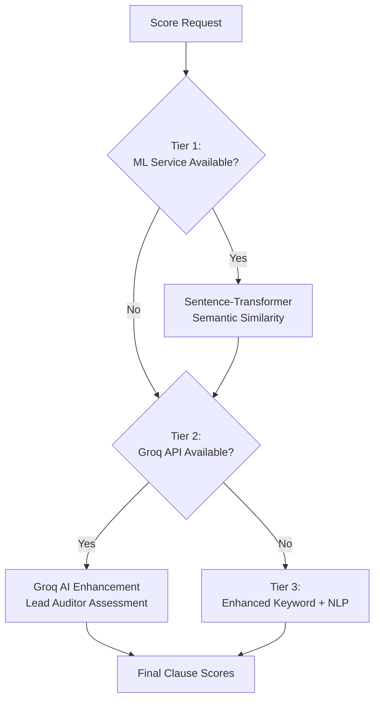
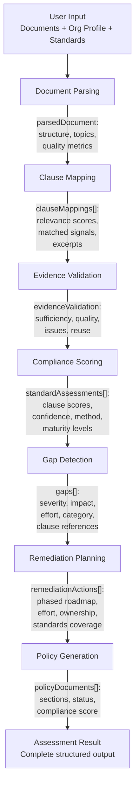

# AI Agent Pipeline

## Pipeline Overview

SentriX's core intelligence is delivered through a coordinated team of nine specialized AI agents. Seven agents execute sequentially in the assessment pipeline, each building on the output of the previous agent. Two additional agents (the SentriX Copilot and the orchestrator wrapper) operate outside the main pipeline.

```mermaid
graph LR
    subgraph Pipeline["Assessment Pipeline (Sequential)"]
        direction LR
        A1["1. Document<br/>Parsing Agent"] --> A2["2. Clause<br/>Mapping Agent"]
        A2 --> A3["3. Evidence<br/>Validation Agent"]
        A3 --> A4["4. Compliance<br/>Scoring Agent"]
        A4 --> A5["5. Gap<br/>Detection Agent"]
        A5 --> A6["6. Remediation<br/>Planning Agent"]
        A6 --> A7["7. Policy<br/>Generation Agent"]
    end

    A7 -->|"assessment<br/>context"| A8["8. AI Compliance<br/>Copilot"]

    style A1 fill:#1a365d
    style A2 fill:#1a365d
    style A3 fill:#1a365d
    style A4 fill:#1a365d
    style A5 fill:#1a365d
    style A6 fill:#1a365d
    style A7 fill:#1a365d
    style A8 fill:#2d3748
```



Each agent follows the same execution pattern:

1. Receive accumulated pipeline context
2. Attempt execution via OmniAgent module (if configured)
3. Fall back to the Anthropic Claude API with expert prompt (`claude-sonnet-5`; `claude-fable-5` for remediation planning and policy generation)
4. Fall back to local intelligence algorithm
5. Return structured output in a standardized schema
6. Emit progress events via SSE to the connected client

---

## Agent 1: Document Parsing Agent

**Role**: Extract structure and meaning from uploaded governance documents.

**GenW Module**: `documentIntelligence`

### Input

| Field | Type | Description |
|-------|------|-------------|
| `documentText` | `string` | Combined text from all uploaded documents (PDF, DOCX, TXT) |
| `orgProfile` | `OrgProfile` | Organization context (company, industry, size) |

### Processing Logic

The agent analyzes raw document text to identify:

- **Document structure**: Sections, headings, paragraphs, lists
- **Policy elements**: Policy statements, scope definitions, roles and responsibilities
- **Compliance signals**: References to standards, regulatory language, control descriptions
- **Evidence markers**: Dates, metrics, implementation status language

**Local Fallback (analyzeDocumentText)**:  
Uses NLP-based analysis with:
- Keyword taxonomy matching (3,500+ compliance terms)
- Compliance phrase pattern detection (17 weighted patterns)
- Section boundary identification via heading patterns
- Evidence example matching against clause evidence databases

### Output

```typescript
{
  documentStructure: {
    sectionCount: number;
    keyTopics: string[];
    complianceReferences: string[];
    policyElements: string[];
  };
  textQuality: {
    wordCount: number;
    complianceTermDensity: number;
    structureScore: number;
  };
  summary: string;
}
```

### Data Passed Forward

The parsed document structure enriches the pipeline context, enabling subsequent agents to:
- Focus clause mapping on relevant document sections
- Identify evidence-bearing passages for validation
- Understand document quality when interpreting scores

---

## Agent 2: Clause Mapping Agent

**Role**: Map document content to specific ISO clause requirements with relevance scoring.

**GenW Module**: `complianceKnowledge`

### Input

| Field | Type | Description |
|-------|------|-------------|
| `documentText` | `string` | Full document text |
| `standards` | `string[]` | Selected ISO standard codes |
| `parsedDocument` | `object` | Output from Document Parsing Agent |
| `clauseDefinitions` | `ISOClause[]` | Complete clause library for selected standards |

### Processing Logic

For each clause in each selected standard, the agent calculates a relevance score determining how strongly the document addresses that clause's requirements.

**Local Relevance Scoring Algorithm**:

```
Relevance Score = Keyword Match (40%)
                + Taxonomy Coverage (15%)
                + Compliance Phrase Patterns (15%)
                + Contextual Proximity Bonus (12%)
                + Evidence Example Matching (15%)
                + Document Volume Bonus (5%)
```

| Component | Weight | Method |
|-----------|--------|--------|
| Keyword Match | 40% | Direct keyword presence from clause keyword list |
| Taxonomy Coverage | 15% | Coverage of standard/category taxonomy terms |
| Compliance Phrases | 15% | Weighted NLP pattern matching (17 patterns, weights -10 to +15) |
| Proximity Bonus | 12% | Co-occurrence of multiple clause keywords within 500-character windows |
| Evidence Examples | 15% | Presence of evidence-type language matching clause evidence examples |
| Volume Bonus | 5% | Document length normalization (longer documents with relevant content score higher) |

### Output

```typescript
{
  clauseMappings: Array<{
    clauseId: string;
    clauseTitle: string;
    category: string;
    relevanceScore: number;       // 0-100
    matchedSignals: string[];     // Keywords/phrases that triggered the match
    excerpt: string;              // Relevant document excerpt
  }>;
}
```

### Data Passed Forward

Clause mappings tell the scoring agent which clauses have document coverage and at what confidence level. Clauses with low relevance scores are likely gaps.

---

## Agent 3: Evidence Validation Agent

**Role**: Assess whether document content constitutes sufficient compliance evidence for each clause.

**GenW Module**: `evidenceValidator`

### Input

| Field | Type | Description |
|-------|------|-------------|
| `documentText` | `string` | Full document text |
| `clauseMappings` | `ClauseMappingCandidate[]` | Output from Clause Mapping Agent |
| `clauseDefinitions` | `ISOClause[]` | Clause requirements with evidence examples |

### Processing Logic

For each mapped clause, the agent evaluates:

1. **Sufficiency**: Does the evidence meet the clause's mandatory requirements?
2. **Quality Level**: Is the evidence direct (policy statement), indirect (implied by process), anecdotal (mentioned but not demonstrated), or none?
3. **Issue Identification**: What specific gaps exist in the evidence?
4. **Cross-Standard Reuse**: Can this evidence satisfy requirements in other standards?

**Validation Result Categories**:

| Result | Criteria |
|--------|----------|
| `sufficient` | Direct evidence of implementation with measurable outcomes |
| `partial` | Some evidence exists but incomplete or lacks specificity |
| `insufficient` | Evidence mentioned but does not demonstrate compliance |
| `missing` | No evidence found for this clause |

**Quality Level Classification**:

| Level | Description |
|-------|-------------|
| `direct` | Explicit policy statement, documented procedure, or implementation record |
| `indirect` | Implied through related processes or organizational structure |
| `anecdotal` | Referenced in passing without substantiation |
| `none` | No evidence artifact identified |

### Output

```typescript
{
  evidenceValidation: {
    items: Array<{
      id: string;
      clauseId: string;
      standardCode: string;
      evidenceText: string;
      validationResult: "sufficient" | "partial" | "insufficient" | "missing";
      qualityScore: number;         // 0-100
      qualityLevel: "direct" | "indirect" | "anecdotal" | "none";
      issues: string[];
      recommendation: string;
      crossStandardReuse: string[];  // Other standard codes where this evidence applies
    }>;
    summary: string;
    overallScore: number;
  };
}
```

### Data Passed Forward

Evidence validation results feed into the compliance scoring agent, where evidence quality directly influences clause scores. The cross-standard reuse data enables synergy detection in remediation planning.

---

## Agent 4: Compliance Scoring Agent

**Role**: Calculate clause-level and standard-level compliance scores using a three-tier hybrid engine.

**GenW Module**: `riskAnalytics`

### Input

| Field | Type | Description |
|-------|------|-------------|
| `documentText` | `string` | Full document text |
| `standards` | `string[]` | Selected standard codes |
| `clauseMappings` | `ClauseMappingCandidate[]` | Clause relevance scores |
| `evidenceValidation` | `object` | Evidence quality assessments |
| `clauseDefinitions` | `ISOClause[]` | Full clause library |

### Processing Logic

The Hybrid Scoring Service implements a three-tier cascade:



**Tier 1 — ML Semantic Scoring** (Python microservice):
- Uses sentence-transformer models to calculate semantic similarity between document passages and clause requirement descriptions.
- Called via HTTP POST to the Python scoring service at port 5001.
- Returns base similarity scores per clause.

**Tier 2 — Groq AI Enhancement**:
- Sends clause context, document excerpt, and Tier 1 scores (if available) to Groq's `openai/gpt-oss-120b`.
- The prompt frames the model as a lead ISO auditor performing a detailed assessment.
- Can refine or override Tier 1 scores based on nuanced understanding.

**Tier 3 — Enhanced Keyword + NLP** (always available):
- Same algorithm as clause mapping relevance scoring.
- Produces audit-defensible scores even without any external services.
- Used as the universal fallback.

**Confidence Scoring**:

Each clause score includes a confidence metric calculated as:

```
Base Confidence = Method weight (ML: 70, Groq: 60, Keyword: 45)
                + Match ratio bonus (0-20)
                + Phrase match bonus (0-15)
```

**Maturity Level Mapping**:

| Score Range | Maturity Level | Label |
|-------------|---------------|-------|
| 0–20 | Level 1 | Ad-hoc |
| 21–40 | Level 2 | Defined |
| 41–60 | Level 3 | Managed |
| 61–80 | Level 4 | Quantified |
| 81–100 | Level 5 | Optimizing |

### Output

```typescript
{
  standardAssessments: Array<{
    standard: string;        // e.g., "ISO37001"
    name: string;            // e.g., "Anti-Bribery Management Systems"
    overallScore: number;    // 0-100
    maturityLevel: number;   // 1-5
    clauseScores: Array<{
      clauseId: string;
      clauseTitle: string;
      score: number;         // 0-100
      confidence: number;    // 0-100
      confidenceLevel: string;
      method: string;        // "ml+groq" | "ml-only" | "groq-only" | "keyword-fallback"
      finding: string;       // Narrative finding
    }>;
    scoringMethod: string;
    averageConfidence: number;
  }>;
}
```

### Data Passed Forward

Clause scores are the primary input for gap detection — low-scoring clauses become gaps, with severity weighted by clause criticality.

---

## Agent 5: Gap Detection Agent

**Role**: Identify compliance gaps, classify severity, and benchmark against industry standards.

**GenW Module**: (uses Groq/local — no dedicated GenW module)

### Input

| Field | Type | Description |
|-------|------|-------------|
| `standardAssessments` | `StandardAssessment[]` | Clause scores from scoring agent |
| `clauseDefinitions` | `ISOClause[]` | Clause weights and requirements |
| `orgProfile` | `OrgProfile` | Industry context for benchmarking |
| `industryBenchmarks` | `object` | Average scores for the organization's industry |

### Processing Logic

**Gap Severity Classification**:

```
Exposure = (100 - Score) × (Weight / 5)

if Exposure ≥ 50  → Critical
if Exposure ≥ 30  → High
if Exposure ≥ 15  → Medium
otherwise         → Low
```

For each gap, the agent:
1. Calculates impact score (1–10) based on clause weight and regulatory pressure
2. Calculates effort score (1–10) based on category complexity and organizational maturity
3. Assigns a descriptive title and explanation referencing specific clause requirements
4. Maps to a category (policy, process, training, technology, documentation)

**Industry Benchmark Enrichment**:  
Gaps are compared against industry averages from the knowledge base (7 industries tracked). A gap in a clause where the organization scores significantly below industry average receives elevated severity.

### Output

```typescript
{
  gaps: Array<{
    id: string;
    title: string;
    severity: "critical" | "high" | "medium" | "low";
    standard: string;
    clauseRef: string;
    impactScore: number;     // 1-10
    effortScore: number;     // 1-10
    description: string;
    category: "policy" | "process" | "training" | "technology" | "documentation";
  }>;
}
```

### Data Passed Forward

Gaps drive remediation planning — each remediation action is linked to one or more gaps, and gap severity determines action priority and phasing.

---

## Agent 6: Remediation Planning Agent

**Role**: Generate a phased, actionable remediation roadmap with effort estimates and ownership assignments.

**GenW Module**: `remediationEngine`

### Input

| Field | Type | Description |
|-------|------|-------------|
| `gaps` | `Gap[]` | Classified gaps from gap detection |
| `orgProfile` | `OrgProfile` | Organizational context |
| `crossStandardMappings` | `object` | Synergy areas for multi-standard efficiency |

### Processing Logic

The agent organizes remediation into three phases based on gap severity and effort:

| Phase | Timeline | Focus |
|-------|----------|-------|
| Phase 1 | 0–30 days | Critical and high-severity gaps, quick wins |
| Phase 2 | 30–60 days | Medium-severity gaps, process improvements |
| Phase 3 | 60–120 days | Low-severity gaps, optimization, long-term enhancements |

**Effort Estimation**:

Base effort is calculated from gap severity and category:

```
Base Effort (days) = Severity multiplier × Category multiplier

Severity: critical=15, high=10, medium=7, low=3
Category: policy=1.0, process=1.5, training=1.2, technology=2.0, documentation=0.8
```

**Cross-Standard Synergy**:  
When a remediation action addresses a requirement shared across standards (e.g., risk management appears in all four standards), the agent identifies the synergy and attributes efficiency gains (35–70% per synergy area).

**Ownership Assignment**:  
Each action is assigned to a responsible function based on category:
- Policy → Compliance & Legal
- Process → Operations & Process Improvement
- Training → HR & Training
- Technology → IT & Security
- Documentation → Quality & Compliance

### Output

```typescript
{
  remediationActions: Array<{
    id: string;
    title: string;
    description: string;
    priority: "critical" | "high" | "medium" | "low";
    phase: 1 | 2 | 3;
    effortDays: number;
    standard: string;
    responsible: string;
    successMetric: string;
    standardsCoverage: string[];  // Standards benefiting from this action
  }>;
}
```

---

## Agent 7: Policy Generation Agent

**Role**: Generate ready-to-adopt policy documents that address identified compliance gaps.

**GenW Module**: `policyGenerator`

### Input

| Field | Type | Description |
|-------|------|-------------|
| `gaps` | `Gap[]` | Identified gaps |
| `standardAssessments` | `StandardAssessment[]` | Current compliance status |
| `orgProfile` | `OrgProfile` | Organization context |
| `remediationActions` | `RemediationAction[]` | Planned remediation roadmap |

### Processing Logic

For each assessed standard, the agent generates a policy document containing:

1. **Policy statement** aligned to the standard's objective
2. **Scope definition** based on organizational context
3. **Roles and responsibilities** mapped to gap categories
4. **Control procedures** addressing each identified gap
5. **Monitoring and review** requirements
6. **Status marking**: Each section tagged as `new` (addressing a gap), `revised` (improving existing coverage), or `retained` (confirming adequate existing controls)

### Output

```typescript
{
  policyDocuments: Array<{
    id: string;
    standardCode: string;
    standardName: string;
    title: string;
    version: string;
    effectiveDate: string;
    sections: Array<{
      sectionNumber: string;
      title: string;
      clauseRef: string;
      content: string;
      status: "new" | "revised" | "retained";
    }>;
    complianceScore: number;
    gapsAddressed: number;
    summary: string;
  }>;
}
```

---

## Agent 8: SentriX Copilot

**Role**: Context-aware compliance Q&A assistant that answers questions using assessment data, uploaded documents, and ISO knowledge.

**GenW Module**: `complianceCopilot`

The Copilot operates outside the main pipeline. It receives the complete assessment context and uses it to answer natural language compliance questions.

### Input

| Field | Type | Description |
|-------|------|-------------|
| `message` | `string` | User's question |
| `assessmentId` | `string` | Reference to completed assessment |
| `conversationHistory` | `array` | Previous messages for context continuity |
| `context` | `CopilotContextSnapshot` | Assessment results, org profile, documents |

### Processing Logic

1. **Context Resolution**: Merges runtime session data with request context to build a comprehensive view (org profile, document snippets, clause scores, gaps, remediation actions).

2. **Document Snippet Extraction**: Identifies relevant passages from uploaded documents using keyword matching against the question (max 3 snippets).

3. **Relevant Guidance Derivation**: Finds applicable ISO guidance based on question keywords and weakest clauses/standards.

4. **Response Generation**: Uses a detailed system prompt that frames the model as an expert ISO compliance advisor with access to the organization's specific assessment data.

### Output

```typescript
{
  headline: string;              // Brief answer title
  directAnswer: string;          // Concise direct response
  explanation: string;           // Detailed explanation with context
  evidence: Array<{
    source: string;              // "organization-profile" | "uploaded-document" | etc.
    label: string;
    detail: string;
  }>;
  recommendedActions: Array<{
    action: string;
    priority: string;
    rationale: string;
  }>;
  isoGuidance: Array<{
    standard: string;
    clause: string;
    requirement: string;
    guidance: string;
  }>;
  reportSummary: string[];
  followUpQuestions: string[];
  auditTrail: {
    responseMode: string;        // "genw" | "groq" | "local"
    structuredFormat: boolean;
    assessmentReference: string;
    contextSources: string[];
    pipelineProvider: string;
    generatedAt: string;
    caveats: string[];
  };
}
```

### Audit Trail

Every copilot response includes an audit trail documenting:
- Which AI provider generated the response (GenW, Groq, or local)
- What context sources were used (org profile, documents, clause scores, gaps, etc.)
- Whether the response used structured format
- Any caveats or limitations

---

## Agent Prompt Engineering

Each agent uses carefully crafted prompts that:

1. **Declare authority**: The model is told it is an "ISO lead auditor" or "senior compliance consultant" with specific domain expertise.
2. **Set strict rules**: No inflated scores, no hedging without evidence, reference specific clauses.
3. **Enforce output schema**: JSON response format with explicit field specifications.
4. **Provide context**: Organization profile, industry, document excerpts, previous agent outputs.
5. **Include benchmarks**: Industry averages and common audit findings for calibration.

Example prompt structure (simplified):

```
You are a certified ISO [STANDARD] Lead Auditor with 15+ years of experience.

ROLE: Assess compliance of [COMPANY] in [INDUSTRY] against [STANDARD_NAME].

RULES:
- Never score above 80 without direct, documented evidence
- Reference specific clause IDs in all findings
- Apply pessimistic bias (real auditors are conservative)
- If no evidence found, score is 0

DOCUMENT TEXT:
[First 8000 characters of uploaded documents]

CLAUSES TO ASSESS:
[Clause definitions with requirements]

Respond in JSON format:
{
  "clauseScores": [{ "clauseId": "...", "score": 0-100, "finding": "..." }]
}
```

---

## Inter-Agent Data Flow Summary


