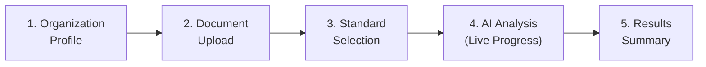

# Frontend Architecture

## Technology Stack

| Technology | Version | Purpose |
|-----------|---------|---------|
| React | 19 | Component framework with concurrent features |
| TypeScript | 5.8 | Type-safe development |
| Vite | 6 | Build tool with HMR and code splitting |
| Tailwind CSS | 4 | Utility-first styling with CSS custom properties |
| Framer Motion | 12 | Page transitions and micro-animations |
| Recharts | 3.8 | Data visualization (radar, bar, pie, scatter, line charts) |
| Zustand | 5 | Lightweight state management with persistence |
| React Router | 7 | Client-side routing with lazy loading |
| Lucide React | 0.577 | Consistent icon system |
| Fuse.js | 7 | Fuzzy search for global command palette |
| Axios | 1.13 | HTTP client with interceptors |
| jsPDF | 4.2 | Client-side PDF report generation |
| react-hot-toast | 2.6 | Toast notifications |

---

## Page Layout System

### Application Shell

The application uses a two-tier layout system:

1. **Landing Page** (`/`): Renders outside the application shell as a standalone marketing page with its own navigation header.

2. **App Shell** (`AppLayout`): Wraps all authenticated routes with shared chrome:

```
┌─────────────────────────────────────────────────────┐
│ ┌──────────┐ ┌────────────────────────────────────┐ │
│ │          │ │ Navbar                              │ │
│ │          │ ├────────────────────────────────────┤ │
│ │ Sidebar  │ │                                    │ │
│ │          │ │ Page Content (Outlet)               │ │
│ │          │ │                                    │ │
│ │          │ │                                    │ │
│ │          │ │                                    │ │
│ └──────────┘ └────────────────────────────────────┘ │
│                                                     │
│ ┌─────────────────────────────────────────────────┐ │
│ │ Chat Assistant (FAB + Drawer)                   │ │
│ └─────────────────────────────────────────────────┘ │
│ ┌─────────────────────────────────────────────────┐ │
│ │ Global Search (Ctrl+K Modal)                    │ │
│ └─────────────────────────────────────────────────┘ │
└─────────────────────────────────────────────────────┘
```

### Sidebar Navigation

The sidebar organizes 12 pages into three sections:

| Section | Pages | Purpose |
|---------|-------|---------|
| **Workspace** | Dashboard, Assessment, Standards, Reports | Core assessment workflow |
| **Intelligence** | Knowledge Base, Risk Intelligence, Control Library, Analytics | Analytical tools and reference data |
| **Operations** | Agent Workflow, Agent Monitoring, Remediation Tracker, Settings | System management and execution tracking |

The sidebar supports collapse/expand mode. On mobile viewports (<768px), it auto-collapses to icon-only width.

### Navbar

The navbar displays:
- **Left**: Page-specific metadata (section label, page title, description) derived from `pageMetaByPath` configuration.
- **Center**: Global search trigger (Ctrl+K shortcut).
- **Right**: Standards scope indicator, demo mode badge, organization name, theme toggle, notifications dropdown, "New Assessment" action button.

---

## Navigation Architecture

### Route Configuration

All routes use `React.lazy()` with `Suspense` fallback for code splitting:

```typescript
// Route structure (simplified)
<Routes>
  <Route path="/" element={<Landing />} />            {/* Standalone */}
  <Route element={<AppLayout />}>                      {/* App Shell */}
    <Route path="/dashboard" element={<Dashboard />} />
    <Route path="/assessment" element={<Assessment />} />
    <Route path="/standards" element={<Standards />} />
    <Route path="/reports" element={<Reports />} />
    <Route path="/analytics" element={<Analytics />} />
    <Route path="/knowledge-base" element={<KnowledgeBase />} />
    <Route path="/risk-intelligence" element={<RiskIntelligence />} />
    <Route path="/control-library" element={<ControlLibrary />} />
    <Route path="/remediation-tracker" element={<RemediationTracker />} />
    <Route path="/agent-monitoring" element={<AgentMonitoring />} />
    <Route path="/agent-workflow" element={<AgentWorkflow />} />
    <Route path="/settings" element={<Settings />} />
  </Route>
</Routes>
```

### Page Transitions

All page transitions use Framer Motion's `AnimatePresence`:

```typescript
// Transition configuration
initial:  { opacity: 0, y: 12 }
animate:  { opacity: 1, y: 0 }
exit:     { opacity: 0, y: -12 }
duration: 0.25s
```

---

## Component System

### Component Directory Structure

```
components/
├── layout/
│   ├── AppLayout.tsx          # Application shell wrapper
│   ├── Sidebar.tsx            # Navigation sidebar with collapse
│   └── Navbar.tsx             # Top navigation bar
├── dashboard/
│   ├── ChatAssistant.tsx      # AI Copilot chat drawer
│   ├── ComplianceScoreRing.tsx # Animated SVG score visualization
│   └── KPICard.tsx            # Key metric card with animation
├── analytics/
│   ├── ClauseHeatmap.tsx      # Clause score color grid
│   ├── ComplianceReadinessTimeline.tsx  # Scenario-based forecast
│   ├── GapPriorityMatrix.tsx  # Impact vs effort scatter plot
│   └── OrganizationalRiskHeatmap.tsx   # 5x5 risk matrix
├── reports/
│   ├── EvidenceValidationPanel.tsx # Evidence quality breakdown
│   ├── PolicyGeneratorPanel.tsx    # Generated policy viewer/download
│   └── RemediationTimeline.tsx     # Phased action timeline
├── agents/
│   └── AgentActivityFeed.tsx  # Agent status event feed
├── ui/
│   ├── EnterpriseComponents.tsx  # Shared UI primitives
│   └── EnterpriseLayout.tsx      # Page layout primitives
├── ErrorBoundary.tsx          # React error boundary
├── EvidenceMapper.tsx         # Two-pane clause evidence viewer
├── GlobalSearch.tsx           # Command palette (Ctrl+K)
├── NotificationsDropdown.tsx  # Notification bell + dropdown
├── Skeleton.tsx               # Loading skeleton primitives
└── ThemeController.tsx        # Theme mode controller
```

### Shared UI Primitives (EnterpriseComponents.tsx)

| Component | Props | Purpose |
|-----------|-------|---------|
| `StatusBadge` | `status` | Compliant / Partial / Non-Compliant / Pending pills |
| `RiskChip` | `level` | Critical / High / Medium / Low severity badges |
| `RiskIndicator` | `score` | Inline colored dot with risk label |
| `ScoreBadge` | `score` | Percentage score with colored background |
| `ClauseStatusTag` | `status` | Implemented / Partial / Planned / Not-started tags |
| `SectionHeader` | `label, title, description, action` | Section heading with optional action button |
| `DataTable` | `columns, data, rowKey, caption` | Generic data table with customizable columns |
| `SummaryStatCard` | `label, value, description, tone` | KPI card with label and description |
| `InsightCard` | `eyebrow, title, description, badges, tone` | Three-column insight display |
| `ActionCard` | `title, description, action` | Card with embedded action element |
| `WorkflowStage` | `index, title, description, state` | Numbered workflow step card |
| `EmptyState` | `icon, title, description, action` | Placeholder for empty views |
| `LoadingRows` | `count, columns` | Skeleton table row generator |
| `InfoTooltip` | `text` | Compact tooltip trigger |

### Layout Primitives (EnterpriseLayout.tsx)

| Component | Props | Purpose |
|-----------|-------|---------|
| `PageHero` | `eyebrow, title, description, actions, aside` | Page header with optional score ring |
| `MetricCard` | `label, value, caption, tone` | Large-format metric display |
| `Panel` | `label, title, description, action, children` | Content card with header |
| `EmptyWorkspace` | `title, description, actions` | Full-page empty state |

---

## Analytics Dashboards

### Dashboard Page

The executive command center displays:

| Section | Visualization | Data Source |
|---------|--------------|-------------|
| Compliance Score | Animated SVG ring | `currentAssessment.overallScore` |
| KPI Grid | 4 metric cards | Score, standards count, critical gaps, last review |
| Readiness Timeline | Phase projections | `ComplianceReadinessTimeline` component |
| Standards Scorecard | Data table | `standardAssessments[]` |
| Radar Chart | Target comparison | Current scores vs 85% target overlay |
| Risk Heatmap | 5×5 matrix | `OrganizationalRiskHeatmap` component |
| Priority Actions | Action cards | Top 4 remediation actions |
| Gap Matrix | Scatter plot | `GapPriorityMatrix` component |
| Clause Heatmap | Color grid | `ClauseHeatmap` component |
| Evidence Panel | Summary + list | `EvidenceValidationPanel` component |
| Policy Panel | Document cards | `PolicyGeneratorPanel` component |

### Analytics Page

Portfolio-level analysis:

| Section | Visualization | Purpose |
|---------|--------------|---------|
| Executive Takeaways | 3 summary cards | Primary risk, best position, dominant gap theme |
| Benchmark Delta | Standard comparison | Above/below industry baseline indicators |
| Risk Heatmap | 5×5 matrix with drill-down | Organizational risk exposure modeling |
| Maturity Distribution | Stacked bar chart | Clause count per maturity level per standard |
| Gap Composition | Donut chart | Gap distribution by category |
| Score Trend | Multi-line chart | Score progression across assessment history |
| Benchmark Comparison | Grouped bar chart | Your score vs industry average with regulatory pressure |
| Readiness Timeline | Scenario projections | Remediation impact modeling |

### Visualization Components

**ComplianceScoreRing**: Animated SVG circle with stroke-dasharray animation. Uses `useCountUp` hook for number animation (ease-out cubic, 2000ms). Color-coded by risk level.

**ClauseHeatmap**: Per-standard grid of colored boxes. Each box represents one clause, colored by score (green = compliant, red = critical). Hover reveals clause details.

**GapPriorityMatrix**: Recharts scatter plot with X = effort score, Y = impact score. Bubble size represents priority level. Four labeled quadrants (Quick Wins, Strategic, Monitor, Defer).

**OrganizationalRiskHeatmap**: 5×5 CSS grid (severity × likelihood). Cell colors calculated from exposure scores (severity × likelihood × regulatory pressure). Click-to-drill-down reveals risk details in a side panel.

**ComplianceReadinessTimeline**: Five scenario presets model different remediation strategies. Displays phase milestones with projected scores, effort days, and risk mix distributions. Per-standard current vs. projected progress bars.

---

## Assessment Workflow UI

The assessment page implements a 5-step wizard:



### Step 1: Organization Profile
- Company name (text input)
- Industry (dropdown: Financial Services, Healthcare, Technology, Manufacturing, Government, Retail, Energy)
- Employee count (text input)
- Jurisdiction (text input)
- Maturity level estimate (selection cards: Levels 1–5)

### Step 2: Document Upload
- Drag-and-drop zone with file type validation (PDF, DOCX, TXT only)
- File list with size, type, and remove buttons
- Evidence quality guidance panel
- Maximum 10 files, 20 MB each

### Step 3: Standard Selection
- Multi-select cards for ISO 37001, 37301, 27001, 9001
- Each card shows clause count and scope description
- At least one standard must be selected

### Step 4: AI Analysis
- Real-time agent progress visualization
- 7 agent status indicators (idle → processing → complete)
- Live log stream with timestamps
- Progress bars per agent
- **Demo mode**: Simulated agent sequence with 750ms delays
- **Live mode**: SSE stream from `/api/assessment/{id}/stream`

### Step 5: Results Summary
- Overall score display
- Gap count summary (by severity)
- Evidence item count
- Policy document count
- "Commit to Workspace" button → saves to store → navigates to Dashboard

---

## Design System

### Color Palette

The design system uses CSS custom properties for full light/dark mode support:

```css
/* Primary brand colors */
--color-primary:     #00C389     /* Teal (Enterprise Core-inspired accent) */
--color-primary-dim: #00a87460   /* Semi-transparent teal */

/* Background hierarchy */
--color-bg-base:     #0a0e1a    /* Dark: Deep navy */
--color-bg-raised:   #111827    /* Dark: Elevated surface */
--color-bg-surface:  #1e293b    /* Dark: Card surface */
--color-bg-muted:    #334155    /* Dark: Muted elements */

/* Text hierarchy */
--color-text:        #f1f5f9    /* Primary text */
--color-text-secondary: #94a3b8 /* Secondary text */
--color-text-muted:  #64748b    /* Tertiary/muted text */

/* Risk colors */
--color-risk-low:      #22c55e  /* Green: Compliant */
--color-risk-medium:   #eab308  /* Yellow: Partial */
--color-risk-high:     #f97316  /* Orange: Non-compliant */
--color-risk-critical: #ef4444  /* Red: Critical */

/* Border colors */
--color-border:      #1e293b    /* Standard border */
--color-border-dim:  #1e293b40  /* Subtle border */
```

### Typography

```css
/* Font stack */
font-family: "Inter", -apple-system, BlinkMacSystemFont, "Segoe UI", sans-serif;

/* Scale */
--text-xs:    0.75rem   /* 12px — labels, captions */
--text-sm:    0.875rem  /* 14px — body small, table data */
--text-base:  1rem      /* 16px — body text */
--text-lg:    1.125rem  /* 18px — section titles */
--text-xl:    1.25rem   /* 20px — page subtitles */
--text-2xl:   1.5rem    /* 24px — page titles */
--text-3xl:   2rem      /* 32px — hero headings */
--text-5xl:   3rem      /* 48px — landing hero */
```

### Component Patterns

**Card System**: All cards use consistent styling:
- Background: `var(--color-bg-raised)` or `var(--color-bg-surface)`
- Border: `1px solid var(--color-border)` with border-radius `12px` (or `16px` for panels)
- Padding: `1.25rem` (cards) or `1.5rem` (panels)
- Shadow: Subtle box-shadow on hover

**Metrics Display**: KPI cards use:
- Icon badge with colored background (24px icon, 40px container)
- Label text (small, secondary color)
- Value text (large, primary color, animated count-up)
- Trend indicator (up/down arrow with delta percentage)
- Optional subtitle

**Data Tables**: Consistent across all pages:
- Header row with muted background
- Alternating row backgrounds for readability
- Status badges and score indicators inline
- Caption text below table
- Responsive horizontal scroll on small screens

**Status Badges**: Consistent color coding throughout:
- Green: Compliant, Sufficient, Implemented, Low risk
- Yellow: Partial, Medium risk
- Orange: Non-compliant, Insufficient, High risk
- Red: Critical, Missing

---

## Page Inventory

| Page | Route | Purpose | Empty State |
|------|-------|---------|-------------|
| Landing | `/` | Marketing page with product overview | N/A |
| Dashboard | `/dashboard` | Executive compliance command center | Workflow guide + action buttons |
| Assessment | `/assessment` | 5-step assessment wizard | Default to Step 1 |
| Standards | `/standards` | ISO standards library and explorer | Loading skeleton |
| Reports | `/reports` | Report viewer with PDF export | "No assessment yet" |
| Analytics | `/analytics` | Portfolio analytics and benchmarking | "Run assessment first" |
| Knowledge Base | `/knowledge-base` | Standards metadata and intelligence | Loading skeleton |
| Risk Intelligence | `/risk-intelligence` | Executive risk summary | "Run assessment first" |
| Control Library | `/control-library` | Control inventory with coverage | "Run assessment first" |
| Remediation Tracker | `/remediation-tracker` | Action plan with phases | "Run assessment first" |
| Agent Monitoring | `/agent-monitoring` | Real-time agent status board | "No live activity" |
| Agent Workflow | `/agent-workflow` | Pipeline stage visualization | "Appears after execution" |
| Settings | `/settings` | Theme and integration config | Always visible |

---

## State Management

### Store Structure (Zustand)

```typescript
interface AppState {
  // Assessment data
  currentAssessment: AssessmentResult | null;
  assessmentHistory: AssessmentResult[];
  isAssessing: boolean;
  assessmentStep: number;
  orgProfile: OrgProfile;
  selectedStandards: string[];
  activeAssessmentSessionId: string | null;
  uploadedDocuments: UploadedDocumentReference[];

  // Agent tracking
  agentStatuses: AgentStatus[];  // 7 agents with name, status, progress, currentAction
  agentLog: AgentLogEntry[];

  // Chat
  chatMessages: ChatMessage[];
  isChatOpen: boolean;

  // UI
  sidebarCollapsed: boolean;
  themeMode: "light" | "dark" | "system";
  notifications: Notification[];
  unreadCount: number;
  isDemoMode: boolean;
}
```

### Persistence Strategy

The store persists selectively to `localStorage` key `SentriX-store`:

| Persisted | Not Persisted |
|-----------|--------------|
| `currentAssessment` | `agentStatuses` |
| `assessmentHistory` | `agentLog` |
| `orgProfile` | `chatMessages` |
| `themeMode` | `isChatOpen` |
| `notifications` | `isAssessing` |
| `isDemoMode` | `assessmentStep` |
| | `sidebarCollapsed` |

This ensures assessment results survive page reloads while ephemeral runtime state (agent progress, chat messages) resets cleanly.

### Key Actions

| Action | Description |
|--------|-------------|
| `setAssessment(result)` | Saves assessment, appends to history |
| `loadDemoData()` | Loads hardcoded Acme Corp sample assessment |
| `resetAssessment()` | Clears all assessment data, resets agent states |
| `updateAgentStatus(name, updates)` | Updates single agent's status/progress |
| `addAgentLog(entry)` | Appends to agent event stream |
| `addNotification(notification)` | Adds notification with timestamp |
| `markAllNotificationsRead()` | Marks all notifications as read |

---

## API Integration

### HTTP Client

All API calls use a shared Axios instance with:
- **Base URL**: Proxied via Vite → `http://localhost:3001`
- **Error Interceptor**: Centralized toast notifications for network errors, timeouts, 4xx/5xx responses

### API Modules

```typescript
// Assessment API
assessmentApi.uploadDocuments(files: File[]): Promise<UploadedDocumentInfo[]>
assessmentApi.startAssessment(payload): Promise<{ assessmentId: string }>
assessmentApi.getResults(id: string): Promise<AssessmentResult>

// Copilot API
copilotApi.askQuestion(request: CopilotRequest): Promise<CopilotResponse>

// Standards API
standardsApi.getLibrary(): Promise<StandardLibrary>
standardsApi.getClauses(code: string): Promise<Clause[]>
standardsApi.getQuestionnaire(code: string): Promise<Questionnaire>
standardsApi.getKnowledgeBase(industry?: string): Promise<KnowledgeBase>
```

### SSE Streaming

Assessment progress uses the `useAssessmentStream` custom hook:

```typescript
const { startStream, stopStream } = useAssessmentStream();

// Opens EventSource connection to /api/assessment/{id}/stream
startStream(assessmentId, {
  onEvent: (event) => { /* update agent statuses */ },
  onComplete: (result) => { /* save to store */ },
  onError: (error) => { /* show toast */ }
});
```

### Response Adaptation

Backend responses are transformed to frontend types via `assessmentAdapter.ts`:
- Normalizes field naming conventions
- Generates clause status from scores (`≥85` = implemented, `50-84` = partial, `33-49` = planned, `<33` = not-started)
- Calculates derived fields (impact levels, categories, maturity labels)
- Builds executive summary narrative from assessment statistics
