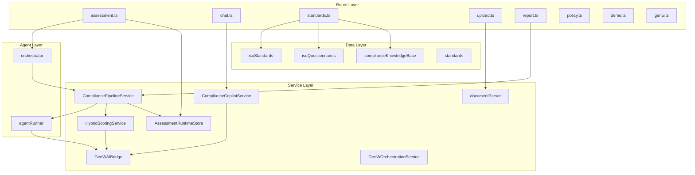
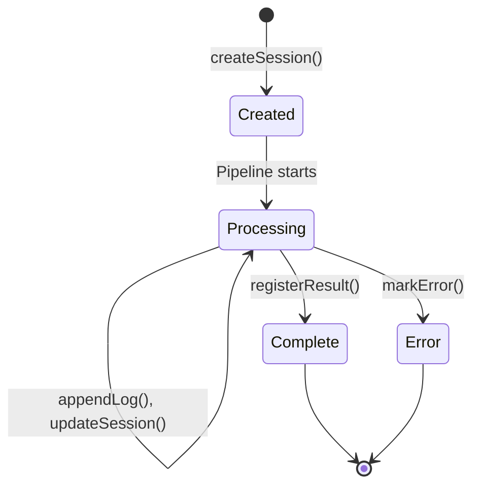

# Backend Services

## Service Architecture

The backend is a Node.js application built with Express 5 and TypeScript. It implements a layered architecture with routes, services, agents, and data modules.



---

## CompliancePipelineService

**File**: `server/src/services/CompliancePipelineService.ts`  
**Purpose**: Orchestrates the 7-agent assessment pipeline with context accumulation and provider fallback.

### Responsibilities

- Manages the sequential execution of all seven pipeline agents
- Maintains a `PipelineContext` object that grows through each stage
- Implements the `executeWithFallback()` pattern for each agent
- Tracks execution metadata (provider, timing, status) for audit trail
- Emits progress callbacks for SSE streaming to connected clients

### Key Method: `run()`

```typescript
async run(input: {
  documentText: string;
  standards: string[];
  orgProfile: AssessmentOrgProfile;
  uploadedDocuments: UploadedDocumentReference[];
}, callbacks: CompliancePipelineCallbacks): Promise<AssessmentResult>
```

**Execution Flow**:

1. Initialize `PipelineContext` with input data
2. Execute each agent in sequence:
   - Emit `onAgentStart` callback
   - Call `executeWithFallback()` for the agent
   - Update pipeline context with agent output
   - Emit `onAgentComplete` callback with summary
3. Assemble final `AssessmentResult` from accumulated context
4. Emit `onComplete` callback with full result

### Provider Routing

Each agent execution follows this cascade:

```typescript
async executeWithFallback(agentName, context) {
  // 1. Try OmniAgent module
  if (genWAIClient.isConfigured()) {
    const moduleId = getGenWAIModuleForAgent(agentName);
    if (moduleId) {
      const result = await genWAIClient.executeAgent(moduleId, payload);
      return { result, provider: "genw" };
    }
  }

  // 2. Fall back to Groq/local via agentRunner
  const result = await runAgent(agentName, prompt, callbacks);
  return { result, provider: result.method || "local" };
}
```

### Clause Mapping Algorithm

When running locally (no GenW or Groq), clause mapping uses a multi-factor relevance scoring algorithm:

```
buildClauseMappings(documentText, clauses) → ClauseMappingCandidate[]

Per clause:
  keywordScore     = (matched keywords / total keywords) × 40
  taxonomyScore    = (matched taxonomy terms / total terms) × 15
  phraseScore      = sum(phrase weights for matched patterns) × 15
  proximityBonus   = (co-occurring keyword pairs in 500-char windows) × 12
  evidenceScore    = (matched evidence types / total types) × 15
  volumeBonus      = min(documentLength / 5000, 1.0) × 5

  totalScore = keywordScore + taxonomyScore + phraseScore + proximityBonus + evidenceScore + volumeBonus
```

---

## ComplianceCopilotService

**File**: `server/src/services/ComplianceCopilotService.ts`  
**Purpose**: Context-aware compliance Q&A with multi-source evidence and audit trail.

### Responsibilities

- Resolves full assessment context from runtime sessions and request data
- Extracts relevant document snippets based on question keywords
- Derives applicable ISO guidance from weakest standards and clauses
- Generates structured responses with evidence attribution
- Maintains response audit trail (provider, sources, caveats)

### Key Method: `answer()`

```typescript
async answer(request: ComplianceCopilotRequest): Promise<ComplianceCopilotResponse>
```

**Processing Steps**:

1. **Context Resolution**: Merge runtime session data with request context
   - Extract org profile, clause scores, gaps, remediation actions
   - Build clause catalog and standards summaries
2. **Document Snippet Extraction**: Find relevant passages using question keyword matching (max 3 snippets, token-bounded)
3. **Guidance Derivation**: Identify applicable ISO guidance based on question and weakest clauses
4. **Response Generation**: Execute provider cascade
   - OmniAgent → Groq API → Local fallback
5. **Audit Trail Construction**: Record response mode, context sources, caveats

### Local Fallback Response

When no AI provider is available, the service generates a comprehensive local response:

```typescript
buildAuditFriendlyFallback(context) → ComplianceCopilotResponse {
  headline: "Compliance Assessment Summary"
  directAnswer: derived from org profile + overall score
  explanation: narrative from standards summaries
  evidence: from assessment data sources
  recommendedActions: from top gaps and remediation actions
  isoGuidance: from relevant clause guidance text
  reportSummary: from executive summary components
  followUpQuestions: generated based on gaps and weak areas
  auditTrail: { responseMode: "local", ... }
}
```

---

## HybridScoringService

**File**: `server/src/services/HybridScoringService.ts`  
**Purpose**: Three-tier compliance scoring engine with cascading fallback.

### Responsibilities

- Orchestrates scoring across three analysis tiers
- Manages health checks for external scoring services
- Produces clause-level and standard-level scores with confidence metrics
- Generates audit findings narrative per clause

### Scoring Tiers

#### Tier 1: ML Semantic Scoring

```typescript
async scoreWithML(documentText, clauses) → ClauseScoreResult[]
```

- Calls Python microservice at `ML_SERVICE_URL` (default `http://localhost:5001`)
- Endpoint: `POST /score-all`
- Uses sentence-transformer models for document-clause semantic similarity
- Returns base similarity scores per clause

#### Tier 2: Groq AI Enhancement

```typescript
async enhanceWithGroq(documentText, clauses, baseScores?) → ClauseScoreResult[]
```

- Sends clause context and Tier 1 scores (if available) to Groq API
- Expert prompt: ISO lead auditor performing detailed assessment
- Can refine, override, or confirm Tier 1 scores
- Returns enhanced scores with narrative findings

#### Tier 3: Enhanced Keyword + NLP

```typescript
scoreWithEnhancedKeywords(documentText, clauses) → ClauseScoreResult[]
```

- Always available, no external dependencies
- Same multi-factor algorithm as clause mapping:
  - Keyword match (40%), taxonomy (15%), phrases (15%), proximity (12%), evidence (15%), volume (5%)
- Produces audit-defensible scores with generated findings

### Confidence Calculation

```typescript
calculateConfidence(method, matchRatio, phraseMatches) → { score, level }

Base:    ML=70, Groq=60, Keyword=45
Bonus:   matchRatio × 20 + min(phraseMatches × 3, 15)
Level:   ≥75 "high" | ≥50 "medium" | "low"
```

### Standard Scoring Aggregation

```typescript
scoreStandard(documentText, standard, clauses) → StandardScoringResult {
  overallScore:      weighted average of clause scores (by clause weight)
  maturityLevel:     score → level mapping (0-20=1, 21-40=2, 41-60=3, 61-80=4, 81-100=5)
  clauseScores:      individual clause results
  scoringMethod:     "ml+groq" | "ml-only" | "groq-only" | "keyword-fallback"
  averageConfidence: mean of clause confidence scores
}
```

---

## GenWAIBridge

**File**: `server/src/services/GenWAIBridge.ts`  
**Purpose**: Integration bridge for Enterprise Core's OmniAgent platform.

### Configuration

```
GENW_API_BASE_URL  — OmniAgent platform base URL
GENW_API_KEY       — Authentication key
GENW_TIMEOUT_MS    — Request timeout (default: 45000ms)
GENW_HEALTH_ENDPOINT — Health check path (default: /health)
```

### OmniAgent Module Catalog

| Module ID | Agent Mapping | Capability |
|-----------|---------------|------------|
| `documentIntelligence` | Document Parsing | AI document structure analysis |
| `riskAnalytics` | Compliance Scoring | Risk-aware scoring models |
| `complianceKnowledge` | Clause Mapping | Standards knowledge graph |
| `remediationEngine` | Remediation Planning | Remediation strategy optimization |
| `auditTrail` | — | Audit log management |
| `evidenceValidator` | Evidence Validation | Evidence quality assessment |
| `policyGenerator` | Policy Generation | Policy document synthesis |
| `complianceCopilot` | Copilot | Interactive compliance Q&A |

### Client Interface

```typescript
class GenWAIClient {
  isConfigured(): boolean;         // Check env vars
  getHealthStatus(): Promise<...>; // HTTP health check with timeout
  executeAgent(moduleId, payload): Promise<string>; // SSE stream execution
}
```

The client parses SSE event streams from OmniAgent endpoints, extracting JSON payloads from `data:` events.

---

## GenWOrchestrationService

**File**: `server/src/services/GenWOrchestrationService.ts`  
**Purpose**: Pipeline metadata and runtime status reporting for OmniAgent integration.

### Methods

| Method | Returns |
|--------|---------|
| `getModuleCatalog()` | All 8 GenW modules with capabilities |
| `getPipelineDefinition()` | 7-stage pipeline with module mappings |
| `getRuntimeStatus()` | Health status + config + fallback strategy |

### Pipeline Definition

```typescript
[
  { order: 1, agentName: "Document Parsing",     moduleId: "documentIntelligence" },
  { order: 2, agentName: "Clause Mapping",        moduleId: "complianceKnowledge" },
  { order: 3, agentName: "Evidence Validation",   moduleId: "evidenceValidator" },
  { order: 4, agentName: "Compliance Scoring",    moduleId: "riskAnalytics" },
  { order: 5, agentName: "Gap Detection",          moduleId: null },
  { order: 6, agentName: "Remediation Planning",  moduleId: "remediationEngine" },
  { order: 7, agentName: "Policy Generation",     moduleId: "policyGenerator" }
]
```

Note: Gap Detection has no dedicated GenW module — it always runs via Groq or local intelligence.

---

## AssessmentRuntimeStore

**File**: `server/src/services/AssessmentRuntimeStore.ts`  
**Purpose**: In-memory session storage for long-running assessment pipelines.

### Session Lifecycle



### Functions

| Function | Purpose |
|----------|---------|
| `createAssessmentRuntimeSession(id, data)` | Initialize session with standards and org profile |
| `updateAssessmentRuntimeSession(id, patch)` | Merge updates into session |
| `appendAssessmentRuntimeLog(id, message)` | Add timestamped log entry |
| `registerAssessmentRuntimeResult(id, result, resultId)` | Store final result with alias |
| `markAssessmentRuntimeError(id, error)` | Flag session as errored |
| `getAssessmentRuntimeSession(id)` | Look up by session ID or result alias |

### Aliasing

The store supports two-way lookup: sessions can be retrieved by their original session ID or by the assessment result ID. This enables the copilot to reference assessment context even when only the result ID is known.

---

## Document Parser

**File**: `server/src/services/documentParser.ts`  
**Purpose**: Multi-format document text extraction.

### Supported Formats

| Format | Library | Method |
|--------|---------|--------|
| `.txt` | Node.js `fs` | Direct file read |
| `.pdf` | `pdf-parse` | PDF text extraction |
| `.docx` | `mammoth` | Word document to text conversion |

### Functions

```typescript
parseDocument(filePath: string): Promise<string>
// Extracts text from a single document

combineDocumentTexts(texts: string[]): string
// Joins multiple documents with "--- DOCUMENT SEPARATOR ---"
```

---

## Agent Runner

**File**: `server/src/agents/agentRunner.ts`  
**Purpose**: Core AI agent execution with intelligent local fallback.

### Responsibilities

- Executes agents via Groq API with expert-crafted prompts
- Falls back to local intelligence when API is unavailable
- Generates prompt templates for each agent type
- Implements local NLP analysis for document understanding

### Local Intelligence Generators

| Generator | Purpose |
|-----------|---------|
| `analyzeDocumentText()` | NLP document analysis: keyword matching, structure identification, compliance signal detection |
| `generateIntelligentGapAnalysis()` | Parses clause scores, classifies gaps by severity using `(100-score) × (weight/5)` formula |
| `generateIntelligentEvidenceValidation()` | Quality assessment of evidence based on clause coverage and document signals |
| `generateIntelligentRemediation()` | Phased roadmap generation with effort estimation and ownership assignment |
| `generateIntelligentPolicyDocs()` | Policy document skeleton creation per standard |

### Prompt Builders

Each agent has a dedicated prompt builder that constructs expert-level prompts:

| Builder | Agent Role | Key Prompt Elements |
|---------|-----------|-------------------|
| `buildDocumentAgentPrompt()` | Document analyst | Document structure, topic extraction |
| `buildStandardAgentPrompt()` | Lead ISO auditor | Clause requirements, scoring rules, evidence rigor |
| `buildGapAnalysisPrompt()` | Gap analysis specialist | Severity classification, industry benchmarks |
| `buildRemediationPrompt()` | Remediation strategist | Phase planning, effort estimation, cross-standard synergy |
| `buildEvidenceValidationPrompt()` | Evidence assessor | Sufficiency criteria, quality levels, reuse identification |
| `buildPolicyGeneratorPrompt()` | Policy architect | Section structure, clause alignment, status marking |

---

## Service Communication

### Internal Service Calls

```
Routes → orchestrator.runOrchestrator()
  → CompliancePipelineService.run()
    → agentRunner.runAgent() (per agent)
      → GenWAIBridge.executeAgent() (primary)
      → Groq SDK chat.completions.create() (fallback)
      → Local intelligence generators (final fallback)
    → HybridScoringService.scoreAllStandards() (for scoring agent)
      → Python ML service (Tier 1)
      → Groq API (Tier 2)
      → Enhanced keyword scoring (Tier 3)
  → AssessmentRuntimeStore (session management)
```

### External Service Communication

| Service | Protocol | Authentication | Timeout |
|---------|----------|---------------|---------|
| Groq Cloud API | HTTPS (REST) | Bearer token (`GROQ_API_KEY`) | Default |
| OmniAgent Platform | HTTPS (SSE) | Bearer token (`GENW_API_KEY`) | 45s default |
| Python ML Service | HTTP (REST) | None (local) | 10s |
