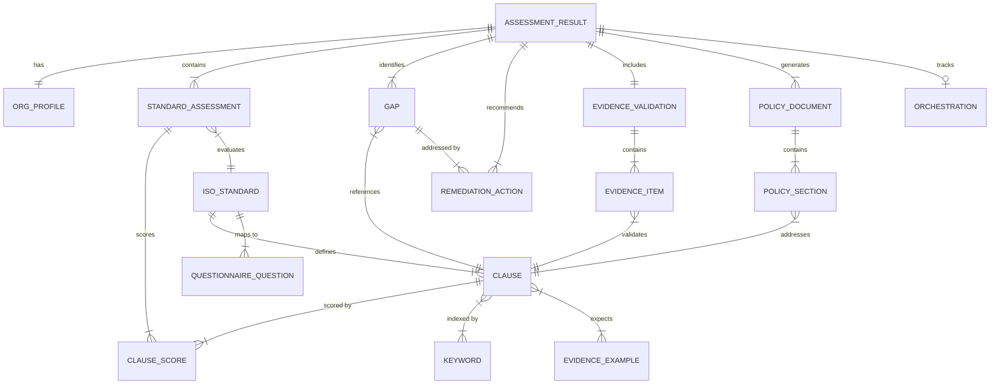
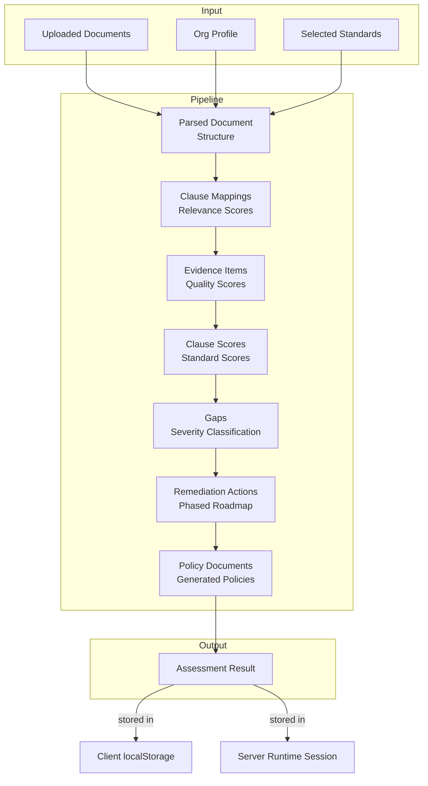

# Data Model

## Entity Overview



---

## Core Entities

### Organization Profile

Captures the organizational context needed for assessment calibration and industry benchmarking.

```typescript
interface OrgProfile {
  company: string;         // Organization name
  industry: string;        // Industry vertical (Financial Services, Healthcare, etc.)
  employees: string;       // Employee count or range
  scope?: string;          // Assessment scope description
  maturityLevel?: number;  // Self-reported maturity estimate (1-5)
  jurisdiction?: string;   // Primary legal jurisdiction
}
```

**Usage**: Drives industry benchmark selection, regulatory pressure weighting, and reporting context.

---

### Assessment Result

The top-level output of a completed compliance assessment pipeline. Contains all analysis outputs.

```typescript
interface AssessmentResult {
  id: string;                                    // Unique assessment identifier (UUID)
  orgProfile: OrgProfile;                        // Organization context
  overallScore: number;                          // Weighted average across standards (0-100)
  maturityLevel: number;                         // Aggregate maturity level (1-5)
  standardAssessments: StandardAssessment[];     // Per-standard analysis
  clauseMappings?: ClauseMappingCandidate[];     // Clause relevance data
  gaps: Gap[];                                   // Identified compliance gaps
  evidenceValidation: EvidenceValidation;        // Evidence quality assessment
  remediationActions: RemediationAction[];       // Phased remediation roadmap
  policyDocuments: PolicyDocument[];             // Generated policy documents
  executiveSummary?: string;                     // Narrative summary text
  orchestration?: OrchestrationMetadata;         // Pipeline execution metadata
  timestamp: string;                             // ISO 8601 completion timestamp
}
```

---

### ISO Standard

Represents a complete ISO management system standard with all clause definitions.

```typescript
interface ISOStandard {
  code: string;           // e.g., "ISO37001"
  name: string;           // e.g., "Anti-Bribery Management Systems"
  fullName: string;       // Official full designation
  version: string;        // Year/version (e.g., "2025")
  totalClauses: number;   // Number of clauses defined
  categories: string[];   // Clause category groupings
  clauses: ISOClause[];   // Complete clause definitions
}
```

**Instances**: ISO 37001 (28 clauses), ISO 37301 (25 clauses), ISO 27001 (23 clauses), ISO 9001 (28 clauses).

---

### Clause

A specific requirement within an ISO standard. The fundamental unit of compliance analysis.

```typescript
interface ISOClause {
  id: string;                  // Clause identifier (e.g., "4.1", "5.2.1")
  title: string;               // Clause name
  description: string;         // Requirement description
  guidance: string;            // Implementation guidance text
  category: string;            // Category classification
  weight: number;              // Criticality weight (1-5)
  keywords: string[];          // NLP matching keywords
  evidenceExamples: string[];  // Typical evidence artifacts
}
```

**Categories**: Context, Leadership, Planning, Support, Operation, Evaluation, Improvement.

**Weight Scale**: 1 = supplementary, 2 = supporting, 3 = standard, 4 = important, 5 = critical. Weights drive scoring aggregation and gap severity calculation.

---

### Standard Assessment

Per-standard assessment output including aggregate score and individual clause results.

```typescript
interface StandardAssessment {
  standard: string;                   // Standard code
  name: string;                       // Standard name
  overallScore: number;               // Weighted average of clause scores (0-100)
  maturityLevel: number;              // Standard-level maturity (1-5)
  clauseScores: ClauseScore[];        // Individual clause assessments
  scoringMethod?: string;             // Method used (ml+groq, groq-only, keyword-fallback)
  confidence?: number;                // Average confidence score
  summary?: string;                   // Narrative summary
}
```

---

### Clause Score

Individual clause compliance assessment result.

```typescript
interface ClauseScore {
  clauseId: string;             // Clause identifier
  clauseTitle: string;          // Clause name
  score: number;                // Compliance score (0-100)
  confidence: number;           // Scoring confidence (0-100)
  confidenceLevel: string;      // "high" | "medium" | "low"
  method: string;               // Scoring method used
  finding: string;              // Narrative assessment finding
  status?: string;              // Derived: implemented/partial/planned/not-started
  evidence?: string;            // Supporting evidence text
  gap?: string;                 // Gap description if applicable
  remediation?: string;         // Recommended remediation
}
```

**Status Derivation**:

| Score Range | Status |
|-------------|--------|
| ≥ 85 | Implemented |
| 50–84 | Partial |
| 33–49 | Planned |
| < 33 | Not Started |

---

### Gap

An identified compliance non-conformity linked to a specific standard and clause.

```typescript
interface Gap {
  id: string;                  // Unique gap identifier
  title: string;               // Descriptive gap title
  severity: string;            // "critical" | "high" | "medium" | "low"
  standard: string;            // Standard code
  clauseRef: string;           // Clause identifier
  impactScore: number;         // Business impact rating (1-10)
  effortScore: number;         // Remediation effort rating (1-10)
  description: string;         // Detailed gap description
  category: string;            // "policy" | "process" | "training" | "technology" | "documentation"
  legalSeverity?: string;      // Legal exposure level
}
```

**Severity Classification Algorithm**:

```
Exposure = (100 - clauseScore) × (clauseWeight / 5)

critical:  Exposure ≥ 50
high:      Exposure ≥ 30
medium:    Exposure ≥ 15
low:       Exposure < 15
```

---

### Remediation Action

A specific task in the phased remediation roadmap.

```typescript
interface RemediationAction {
  id: string;                     // Action identifier
  title: string;                  // Action title
  description: string;            // Detailed action description
  priority: string;               // "critical" | "high" | "medium" | "low"
  phase: number;                  // Remediation phase (1, 2, or 3)
  effortDays: number;             // Estimated effort in working days
  standard: string;               // Primary standard addressed
  responsible: string;            // Responsible organizational function
  successMetric?: string;         // Measurable success criterion
  standardsCoverage?: string[];   // All standards benefiting from this action
}
```

**Phase Definition**:

| Phase | Timeline | Focus |
|-------|----------|-------|
| 1 | 0–30 days | Critical gaps, quick wins, immediate risk reduction |
| 2 | 30–60 days | Medium-severity gaps, process improvements |
| 3 | 60–120 days | Low-severity gaps, optimization, long-term enhancements |

**Effort Estimation Formula**:

```
effortDays = baseDays × categoryMultiplier

baseDays:           critical=15, high=10, medium=7, low=3
categoryMultiplier: policy=1.0, process=1.5, training=1.2, technology=2.0, documentation=0.8
```

---

### Evidence Validation

Assessment of whether uploaded documents provide sufficient evidence for compliance claims.

```typescript
interface EvidenceValidation {
  items: EvidenceValidationItem[];   // Per-clause evidence assessments
  summary: string;                   // Overall evidence quality narrative
  overallScore: number;              // Aggregate evidence quality (0-100)
}

interface EvidenceValidationItem {
  id: string;                        // Item identifier
  clauseId: string;                  // Assessed clause
  standardCode: string;              // Standard code
  evidenceText: string;              // Extracted evidence passage
  validationResult: string;          // "sufficient" | "partial" | "insufficient" | "missing"
  qualityScore: number;              // Quality score (0-100)
  qualityLevel: string;              // "direct" | "indirect" | "anecdotal" | "none"
  issues: string[];                  // Identified issues
  recommendation: string;            // Improvement recommendation
  crossStandardReuse: string[];      // Standards where this evidence can be reused
}
```

---

### Policy Document

An AI-generated compliance policy document addressing identified gaps.

```typescript
interface PolicyDocument {
  id: string;                        // Document identifier
  standardCode: string;              // ISO standard code
  standardName: string;              // Standard name
  title: string;                     // Policy document title
  version: string;                   // Version number
  effectiveDate: string;             // Policy effective date
  sections: PolicySection[];         // Document sections
  complianceScore: number;           // Projected compliance improvement
  gapsAddressed: number;             // Number of gaps this policy addresses
  summary: string;                   // Document summary
}

interface PolicySection {
  sectionNumber: string;             // Section number
  title: string;                     // Section title
  clauseRef: string;                 // Referenced ISO clause
  content: string;                   // Section content text
  status: string;                    // "new" | "revised" | "retained"
}
```

---

### Clause Mapping Candidate

Represents the relevance mapping between a document and a specific clause.

```typescript
interface ClauseMappingCandidate {
  clauseId: string;                  // Clause identifier
  clauseTitle: string;               // Clause name
  category: string;                  // Clause category
  relevanceScore: number;            // Document-clause relevance (0-100)
  matchedSignals: string[];          // Keywords/phrases that triggered the match
  excerpt: string;                   // Relevant document excerpt
}
```

---

### Audit Questionnaire

Structured audit questions aligned to ISO clauses.

```typescript
interface AuditQuestion {
  id: string;                        // Question identifier
  clauseRef: string;                 // Referenced clause
  category: string;                  // Clause category
  question: string;                  // Audit question text
  legalBasis: string;                // Legal/regulatory reference
  severity: string;                  // "mandatory" | "recommended"
  evidenceRequired: string[];        // Required evidence types
  failureConsequence: string;        // Consequence of non-compliance
  scoringCriteria: string;           // Scoring guidance
}
```

---

### Orchestration Metadata

Tracks the execution history and provider usage of the assessment pipeline.

```typescript
interface OrchestrationMetadata {
  executionLog: PipelineAgentExecution[];
  totalDurationMs: number;
}

interface PipelineAgentExecution {
  agentName: string;                 // Agent name (7 pipeline agents)
  provider: string;                  // "genw" | "local" | "groq"
  moduleId?: string;                 // GenW module ID if applicable
  status: string;                    // "completed" | "fallback" | "error"
  startedAt: string;                 // ISO 8601 timestamp
  completedAt: string;               // ISO 8601 timestamp
  summary: string;                   // Execution summary text
}
```

---

### Runtime Session

In-memory session state for long-running assessment pipelines.

```typescript
interface AssessmentRuntimeSession {
  status: string;                    // "processing" | "complete" | "error"
  standards: string[];               // Selected standards
  orgProfile?: OrgProfile;           // Organization context
  uploadedDocuments: UploadedDocumentReference[];
  documentText?: string;             // Combined parsed document text
  result?: AssessmentResult;         // Final result (when complete)
  logs: Array<{                      // Progress log entries
    message: string;
    timestamp: string;
  }>;
  createdAt: string;                 // Session creation timestamp
}
```

---

## Entity Relationships

### Assessment Result Composition

```
AssessmentResult
├── OrgProfile (1:1)
├── StandardAssessment[] (1:N, one per selected standard)
│   └── ClauseScore[] (1:N, one per clause in standard)
├── Gap[] (1:N, derived from low-scoring clauses)
├── EvidenceValidation (1:1)
│   └── EvidenceValidationItem[] (1:N, one per assessed clause)
├── RemediationAction[] (1:N, linked to gaps)
├── PolicyDocument[] (1:N, one per standard)
│   └── PolicySection[] (1:N, per policy document)
└── OrchestrationMetadata (0:1)
    └── PipelineAgentExecution[] (1:7, one per agent)
```

### Standards Knowledge Graph

```
ISOStandard
├── ISOClause[] (1:N)
│   ├── keywords[] (domain terms for NLP)
│   └── evidenceExamples[] (expected artifacts)
├── AuditQuestion[] (1:N, linked via clauseRef)
│   ├── legalBasis (regulatory reference)
│   └── evidenceRequired[] (required evidence types)
└── Cross-Standard Mappings (N:N between standards)
    └── Synergy areas with efficiency percentages
```

### Gap-to-Remediation Chain

```
ClauseScore (low score)
  → Gap (severity derived from score × weight)
    → RemediationAction (phase assigned by severity)
      → PolicySection (status: "new" if gap-driven)
```

---

## Data Flow Through Pipeline


