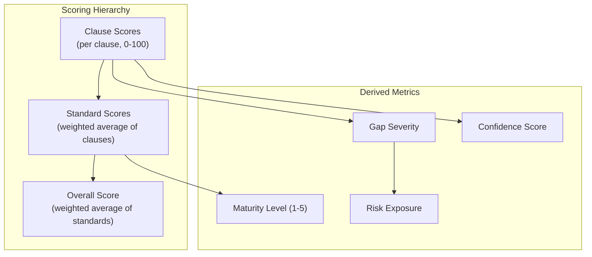

# Analytics and Scoring Logic

## Scoring Overview

SentriX uses a multi-layered scoring system that evaluates organizational compliance at three levels: clause, standard, and overall. Each level builds on the one below, with severity classification and confidence metrics layered on top.



---

## Clause Scoring

### Three-Tier Hybrid Engine

Each clause is scored through a cascading analysis system. The first available tier produces the score, and higher tiers can refine it.

#### Tier 1: ML Semantic Scoring

**Technology**: Python microservice using sentence-transformer models.

**Method**: Calculates cosine similarity between document passage embeddings and clause requirement embeddings. This captures semantic meaning rather than surface-level keyword matching.

**Endpoint**: `POST http://localhost:5001/score-all`

**Input**: Document text + array of clause definitions  
**Output**: Per-clause similarity scores (0–100)

**Strengths**: Captures paraphrased compliance language, understands synonyms, handles varied document styles.  
**Limitations**: Requires running Python service, may not catch domain-specific nuance.

#### Tier 2: Groq AI Enhancement

**Technology**: Groq Cloud API with `openai/gpt-oss-120b` model.

**Method**: Sends clause context, document excerpts, and Tier 1 base scores (if available) to a large language model. The prompt frames the model as a certified ISO Lead Auditor performing a detailed assessment.

**Prompt Strategy**:
- Role: Certified ISO lead auditor with 15+ years of experience
- Rules: Conservative scoring bias, clause-specific references required, no score above 80 without direct documented evidence
- Context: Organization profile, industry benchmarks, document text (first 8000 characters), full clause definitions
- Output: JSON array of `{ clauseId, score, confidence, finding }`

**Strengths**: Expert-level judgment, contextual understanding, nuanced findings.  
**Limitations**: Requires API key, subject to rate limits, variable latency.

#### Tier 3: Enhanced Keyword + NLP

**Technology**: Local Node.js algorithm using keyword taxonomy and pattern matching.

**Always available** — no external dependencies.

**Algorithm**:

```
For each clause:
  documentLower = documentText.toLowerCase()

  // Component 1: Direct keyword matching (40%)
  matchedKeywords = clause.keywords.filter(kw => documentLower.includes(kw))
  keywordScore = (matchedKeywords.length / clause.keywords.length) × 40

  // Component 2: Taxonomy coverage (15%)
  taxonomyTerms = complianceKeywordTaxonomy[standard][category]
  matchedTaxonomy = taxonomyTerms.filter(term => documentLower.includes(term))
  taxonomyScore = (matchedTaxonomy.length / taxonomyTerms.length) × 15

  // Component 3: Compliance phrase patterns (15%)
  phraseScore = 0
  for each pattern in compliancePhrases:
    if pattern.regex.test(documentText):
      phraseScore += pattern.weight
  phraseScore = clamp(phraseScore, 0, 15)

  // Component 4: Contextual proximity bonus (12%)
  proximityScore = 0
  for each pair of matched keywords:
    if keywords appear within 500 characters of each other:
      proximityScore += 2
  proximityScore = min(proximityScore, 12)

  // Component 5: Evidence example matching (15%)
  matchedExamples = clause.evidenceExamples.filter(ex =>
    documentLower.includes(ex.toLowerCase())
  )
  evidenceScore = (matchedExamples.length / clause.evidenceExamples.length) × 15

  // Component 6: Document volume bonus (5%)
  volumeScore = min(documentText.length / 5000, 1.0) × 5

  // Final score
  clauseScore = keywordScore + taxonomyScore + phraseScore
               + proximityScore + evidenceScore + volumeScore
```

| Component | Weight | Measures |
|-----------|--------|----------|
| Keyword Match | 40% | Direct presence of clause-specific keywords |
| Taxonomy Coverage | 15% | Breadth of compliance vocabulary |
| Compliance Phrases | 15% | Regulatory language patterns (17 patterns, weights -10 to +15) |
| Contextual Proximity | 12% | Co-occurrence of related terms within document sections |
| Evidence Examples | 15% | Presence of expected evidence artifact types |
| Document Volume | 5% | Normalization for document comprehensiveness |

---

## Evidence Validation Logic

Evidence validation assesses whether document content constitutes sufficient compliance evidence for each clause.

### Validation Categories

| Category | Criteria | Typical Score Range |
|----------|----------|-------------------|
| **Sufficient** | Direct evidence with measurable outcomes, specific implementation details | 75–100 |
| **Partial** | Some evidence exists but incomplete, lacks specificity or metrics | 40–74 |
| **Insufficient** | Evidence is mentioned but doesn't demonstrate actual compliance | 15–39 |
| **Missing** | No evidence found for this clause requirement | 0–14 |

### Quality Level Assessment

| Level | Description | Indicators |
|-------|-------------|------------|
| **Direct** | Explicit policy statement, documented procedure, or implementation record | Named processes, approval records, date stamps |
| **Indirect** | Implied through related processes or organizational structure | General references, organizational charts, meeting minutes |
| **Anecdotal** | Referenced in passing without substantiation | Mentions without detail, future tense commitments |
| **None** | No evidence artifact identified | Complete absence of relevant content |

### Cross-Standard Evidence Reuse

When an evidence item supports compliance in multiple standards, the system identifies reuse opportunities. For example, a documented risk assessment may satisfy:
- ISO 37001 § 4.5 (Bribery risk assessment)
- ISO 37301 § 4.1 (Compliance risk assessment)
- ISO 27001 § 6.1 (Information security risk assessment)
- ISO 9001 § 6.1 (Quality risk assessment)

Nine cross-standard synergy areas are tracked with efficiency percentages ranging from 35% to 70%.

---

## Confidence Scoring

Every clause score includes a confidence metric indicating how reliable the score is.

### Confidence Calculation

```typescript
function calculateConfidence(method: string, matchRatio: number, phraseMatches: number) {
  // Base confidence by scoring method
  let base: number;
  switch (method) {
    case "ml":       base = 70; break;
    case "groq":     base = 60; break;
    case "keyword":  base = 45; break;
    default:         base = 40;
  }

  // Bonuses
  const matchBonus = matchRatio * 20;          // 0-20 points based on keyword match ratio
  const phraseBonus = Math.min(phraseMatches * 3, 15); // 0-15 points based on phrase matches

  const score = Math.min(base + matchBonus + phraseBonus, 100);

  // Confidence level
  const level = score >= 75 ? "high" : score >= 50 ? "medium" : "low";

  return { score, level };
}
```

### Confidence Interpretation

| Level | Score Range | Interpretation |
|-------|-----------|----------------|
| High | 75–100 | Strong evidence coverage, multiple matching signals, reliable score |
| Medium | 50–74 | Moderate evidence, some ambiguity, score is directionally correct |
| Low | 0–49 | Limited evidence, high uncertainty, treat as provisional estimate |

---

## Benchmark Comparison

### Industry Benchmarks

The knowledge base contains average compliance scores for seven industries:

| Industry | Regulatory Pressure | Key Risk Areas |
|----------|-------------------|----------------|
| Financial Services | Very High | Anti-bribery, information security |
| Healthcare | High | Data privacy, quality management |
| Technology | Medium-High | Information security, compliance |
| Manufacturing | Medium | Quality management, operations |
| Government | High | Anti-corruption, governance |
| Retail | Medium | Supply chain compliance |
| Energy | High | Safety, environmental compliance |

Each industry has:
- Average scores per standard (ISO 37001, 37301, 27001, 9001)
- Common gap patterns
- Regulatory pressure level (low, medium, high, very-high)

### Delta Calculation

The analytics page shows benchmark deltas:

```
delta = organizationScore - industryAverageScore

Positive delta → Above industry average (green indicator)
Negative delta → Below industry average (red indicator)
```

---

## Risk Exposure Scoring

### Organizational Risk Heatmap

The 5×5 risk heatmap plots gaps across severity (Y-axis) and likelihood (X-axis):

```
Exposure = Severity × Likelihood × RegPressureWeight

Where:
  Severity  = 1-5 (based on gap severity classification)
  Likelihood = 1-5 (based on control weakness + evidence absence)
  RegPressureWeight = industry regulatory pressure factor
    low=1.0, medium=1.2, high=1.5, very-high=2.0
```

### Cell Color Gradient

| Exposure Range | Color | Risk Level |
|---------------|-------|-----------|
| ≥ 30 | Dark Red | Critical |
| 15–29 | Orange | High |
| 8–14 | Yellow | Medium |
| < 8 | Green | Low |

### Drill-Down Intelligence

Clicking a cell in the heatmap reveals:
- All gaps in that severity × likelihood bucket
- Highest-risk item narrative
- Risk theme badges (policy, process, training, technology, documentation)
- Peak exposure score

---

## Compliance Readiness Forecasting

### Scenario Engine

The readiness timeline supports five remediation scenarios:

| Scenario | Strategy | Gap Selection |
|----------|----------|--------------|
| Current State | No remediation | None |
| Top 3 Gaps | Fix highest-impact gaps | 3 gaps by severity weight + impact |
| Critical First | Fix all critical gaps | All severity = "critical" |
| Phase 1 Quick Wins | Fix Phase 1 actions | All gaps addressable in 0–30 days |
| Full Roadmap | Fix all identified gaps | All gaps |

### Forecast Algorithm

```typescript
function buildComplianceReadinessForecast(assessment, selectedGapIds) {
  // Group gaps by phase
  const phase1Gaps = selectedGaps.filter(g => remediationPhase(g) === 1);
  const phase2Gaps = selectedGaps.filter(g => remediationPhase(g) === 2);
  const phase3Gaps = selectedGaps.filter(g => remediationPhase(g) === 3);

  // Calculate uplift per gap
  for each gap:
    baseUplift = severityUplift(gap.severity)  // critical=12, high=8, medium=5, low=2
    overlapBonus = crossStandardBonus(gap)      // 0-3 points for multi-standard gaps
    totalUplift = baseUplift + overlapBonus

  // Project phase milestones
  phase1Score = currentScore + sum(phase1Uplifts)
  phase2Score = phase1Score + sum(phase2Uplifts)
  phase3Score = phase2Score + sum(phase3Uplifts)

  // Per-standard projections
  for each standard:
    standardProjection = currentStandardScore + sum(standard-specific uplifts)

  return {
    currentScore,
    projectedScore: phase3Score,
    phases: [
      { phase: 1, score: phase1Score, effortDays, riskMix, gapCount },
      { phase: 2, score: phase2Score, effortDays, riskMix, gapCount },
      { phase: 3, score: phase3Score, effortDays, riskMix, gapCount }
    ],
    standardProjections: [...],
    selectedGaps: [...]
  }
}
```

### Severity Uplift Table

| Gap Severity | Base Uplift (points) |
|-------------|---------------------|
| Critical | 12 |
| High | 8 |
| Medium | 5 |
| Low | 2 |

Cross-standard bonus: When a gap remediation benefits multiple standards, +1 to +3 additional points are applied based on the synergy coverage.

---

## Maturity Model

The maturity model maps compliance scores to capability levels:

| Level | Name | Score Range | Characteristics |
|-------|------|-----------|-----------------|
| 1 | Ad-hoc | 0–20 | No formal processes, reactive approach, ad-hoc compliance activities |
| 2 | Defined | 21–40 | Basic policies documented, some awareness training, inconsistent implementation |
| 3 | Managed | 41–60 | Formal processes, regular training, monitoring in place, some measurement |
| 4 | Quantified | 61–80 | Measured and tracked, continuous improvement, proactive risk management |
| 5 | Optimizing | 81–100 | Industry-leading, fully integrated, automated monitoring, continuous optimization |

---

## Gap Composition Analysis

Gaps are categorized by type for pattern analysis:

| Category | Description | Typical Remediation |
|----------|-------------|-------------------|
| Policy | Missing or inadequate policy documentation | Draft and approve policy documents |
| Process | Missing or ineffective operational processes | Design and implement procedures |
| Training | Insufficient awareness or competency programs | Develop and deliver training programs |
| Technology | Missing or inadequate technical controls | Implement security/compliance tools |
| Documentation | Missing records, evidence, or documentation | Create documentation templates and workflows |

The analytics page visualizes gap composition as a donut chart, showing the distribution of gaps across these five categories.

---

## Score Trend Analysis

When multiple assessments exist in history, the system tracks score progression:

```
Assessment 1 (Jan 2026): Overall 45%
Assessment 2 (Feb 2026): Overall 58%  (+13)
Assessment 3 (Mar 2026): Overall 62%  (+4)
```

The analytics page displays:
- Multi-line chart with per-standard score trends
- Up to 6 historical assessment data points
- Overall score progression line

---

## Standard Status Classification

Standards and clauses are classified based on their scores:

| Status | Score Range | Indicator |
|--------|-----------|-----------|
| Compliant | ≥ 75 | Green |
| Partial | 40–74 | Yellow |
| Non-Compliant | < 40 | Red |

### Control Coverage Calculation

For the Control Library view:

```
Implemented = clauses with score ≥ 85
Partial     = clauses with score 50–84
Missing     = clauses with score < 50

Coverage % = (Implemented / totalClauses) × 100
```
